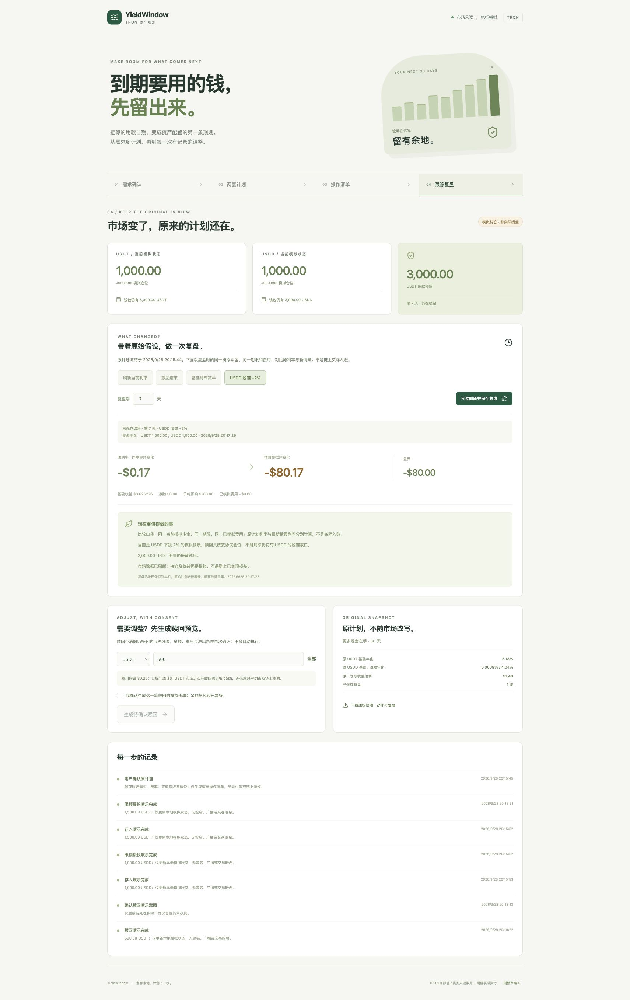

# YieldWindow

> **GWDC 2026 Korea · TRON Challenge B**  
> Protect Friday settlement cash before comparing TRON yield plans.

YieldWindow helps a cross-border commerce finance operator reserve seller payments and refund liquidity before considering JustLend and USDD opportunities. Conversation captures holdings, horizon, liquidity and risk; deterministic code calculates reserves and two plans; a Thursday refund shock recomputes the same decision without moving funds.

**中文简介：** YieldWindow 先锁住周五必须支付的卖家款和退款缓冲，只比较真正闲置的稳定币。它通过问答收集期限、流动性和风险，生成两套方案，并在退款压力变化时重新计算。



## Submission materials · 提交材料

- [Public GitHub repository](https://github.com/Jimmycoding0301/gwdc-2026-yieldwindow)
- [56-second demo video](https://github.com/Jimmycoding0301/gwdc-2026-yieldwindow/raw/refs/heads/main/docs/submission/demo.mp4)
- [Pitch deck](https://github.com/Jimmycoding0301/gwdc-2026-yieldwindow/raw/refs/heads/main/docs/submission/pitch-deck.pptx)

## Core flow · 核心流程

1. Start with 90,000 USDT and 10,000 USDD.
2. Reserve 68,000 USDT seller settlement plus a 12,000 USDT operating buffer.
3. Compare two plans for the remaining 20,000 USD-equivalent amount.
4. Add a 6,000 USDT Thursday refund shock; allocatable capital drops to 14,000.
5. Review base yield, verified incentive window, full-cycle cost, liquidity and exit conditions separately.
6. Confirm the plan and inspect the verified Nile plan receipt.

Qwen3-32B is optional and only rewrites the next clarification question. Balance math, reserves, amounts and action restrictions remain deterministic.

## Verified Nile evidence · 已核验 Nile 证据

- Registry: [`TSqoRAmu4qviTuscsakTWdYRZQjpiTjP2u`](https://nile.tronscan.org/#/contract/TSqoRAmu4qviTuscsakTWdYRZQjpiTjP2u)
- Deployment: [`7f481964…b091`](https://nile.tronscan.org/#/transaction/7f48196490dccdda47e1ca0166d99c7b9b583d4cc5ea5c3b802838c26fd0b091)
- YieldWindow receipt: [`4adaf2cf…a51`](https://nile.tronscan.org/#/transaction/4adaf2cfc03e80c36533cad6024e17de463eedc2efef66da3c1873602c1fca51)
- Public evidence files: [deployment](docs/evidence/registry-deployment.json) and [receipt](docs/evidence/yieldwindow-receipt.json).

This zero-value receipt commits a **demo allocation plan** whose saved market sources were unavailable and clearly labeled fallback data. It proves the plan payload was committed on Nile. It does not prove execution of that USDT/USDD plan or realized yield.

The submission also includes a separate, minimal **live JustLend V1 write-path canary** using 1 test TRX on Nile:

- `mint()` into the official `jTRX` market: [9b2098…b663](https://nile.tronscan.org/#/transaction/9b2098a8751d002bc80ca139737db0ded3cbd64770f71644ab4520aadf30b663)
- `redeemUnderlying(1 TRX)`: [9546eb…28ff](https://nile.tronscan.org/#/transaction/9546eb310aa71bd514a9709b3082e4c525a744539ae6f541069b4a27d36128ff)
- jTRX raw balance: `0 → 8,946,435,518 → 0`
- Reproducible public record: [`docs/evidence/yieldwindow-justlend-canary.json`](docs/evidence/yieldwindow-justlend-canary.json)
- Guarded runner: [`scripts/nile-justlend-canary.mjs`](scripts/nile-justlend-canary.mjs)

The canary proves a real deposit and redemption integration against JustLend. It uses TRX and is deliberately kept separate from the stablecoin treasury story; the USDT/USDD allocation remains simulated.

Recording cues: [docs/demo-script.md](docs/demo-script.md).

## Run locally · 本地运行

```bash
npm ci
cp .env.example .env
npm run dev
```

- Web: <http://127.0.0.1:5176>
- API: <http://127.0.0.1:8790>

The planning demo needs no wallet or API key. macOS Apple Vision is only required for screenshot OCR.

```bash
npm test
npm run build
```

## Optional integrations · 可选接入

- `KILN_API_KEY` enables Qwen clarification wording.
- `NILE_RECEIPT_REGISTRY_ADDRESS` enables a new TronLink-signed plan receipt.
- JustLend and USDD endpoints are read-only market sources. Network failure switches the whole affected snapshot to visibly labeled demo data.

## Honest execution boundary · 执行边界

The product's stablecoin approval, deposit, withdrawal and rebalance steps are simulated and logged locally. No mainnet funds move, no production wallet balance is read, and no yield is guaranteed. The separate Nile jTRX canary is the only live protocol round trip; USDT/USDD execution remains future work.

See [SUBMISSION.md](SUBMISSION.md), [HACKATHON_SCOPE.md](HACKATHON_SCOPE.md), [SECURITY.md](SECURITY.md), [Nile receipt details](docs/nile-receipt.md), and [verification notes](docs/verification.md).

To reproduce the testnet canary with a dedicated, funded Nile wallet, keep the wallet JSON in ignored `.data/tron-nile-wallet.json`, review the fixed Nile RPC and official jTRX address in the script, then run `npm run nile:justlend:canary`. The script verifies chain ID `0xcd8690dc`, simulates each call, saves signed bytes with mode `0600`, broadcasts once, waits for Solidity confirmation, and publishes only sanitized evidence.
